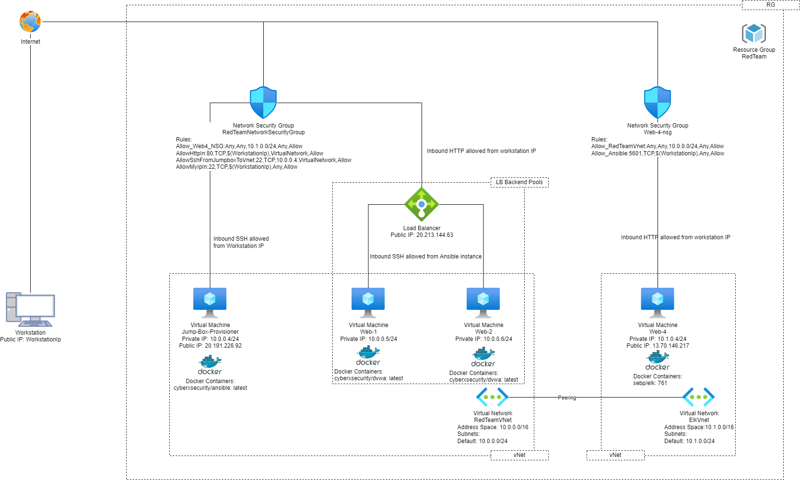
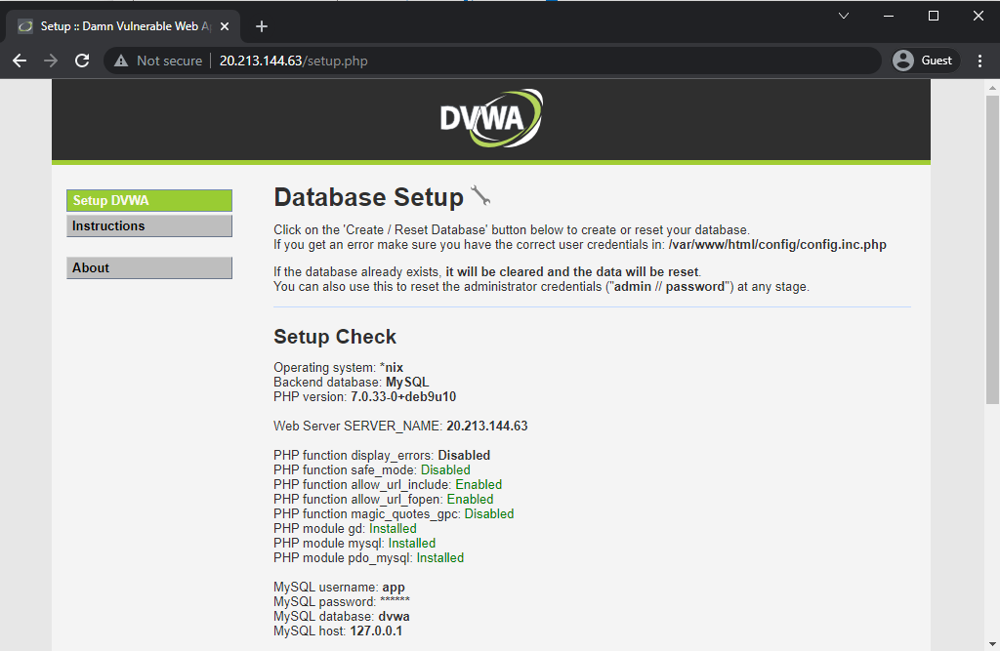
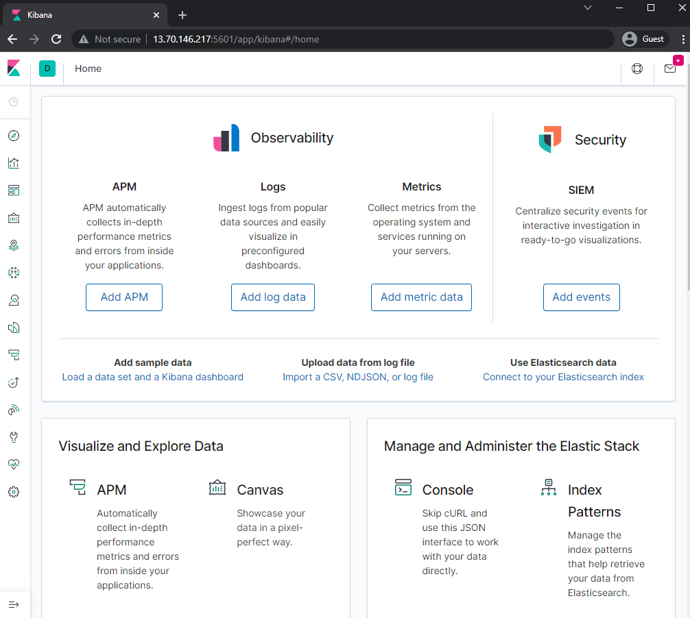

# USyd Cybersecurity Bootcamp - Project 1 ELK Stack Project

## Summary

This is a sample cybersecurity project based on USyd Cybersecurity Bootcamp.

The project is to set up an ELK stack server to monitor the operation of web application, and its infrastructure hosted on cloud.

The infrastructure design implement some good cybersecurity practices that address CIA (Confidentiality, Integrity and Availability).

The technologies used to deliver this project include cloud, network security, DevOps, and operation logging / monitoring.

## Cybersecurity Best Practice

* Least privilege - use the NSG to limit the only required personel can access to the resources. (Confidentiality)
* Use cryptography - use SSH key avoid brute force to passwords (Confidentiality)
* Reduce the attack surface - use the container to deploy the app, such that less process / service is running on the OS
* Load balancer - Web-1 and Web-2 are configured with the load balancer to provide load distribution and high availability, also as a reversed proxy to hide the Web VMs IPs (Availability)
* Peering the vNet - avoid the traffic go to the internet can provide higher bandwidth, more importantly the traffic don't go through the internet to avoid data be manipulated

## Technology

The technologies used in this project includes -

* Azure
* Ansible
* Docker
* DVWA
* ELK 

### Azure

The application are deployed and hosted on Azure. Below is the network schematic overview.

The Azure services used include - 

* Virtual Machines - used for hosting the Linux OS (Ubuntu 18.04 LTS).
  * Jump-Box-Provisioner-VM - used for workstation to connect to, and to connect Web VMs and ELK VM. This VM is exposed to public with a public IP attached.
  * Web-1-VM - used for DVWA application. No public IP. 
  * Web-2-VM - used for DVWA application. No public IP. (Web-1-VM and Web-2-VM have the same setup)
  * Web-4-VM - used for ELK application. This VM is exposed to public with a public IP attached.
* Virtual Network
  * RedTeamVnet - used for Jump-Box, Web-1 and Web-2 VMs
  * ElkVnet - used for Elk VM
  * RedTeamVnet and ElkVnet are peering
* Load Balancer - used for Web-1 and Web-2 DVWA application
* Network Security Group - configured to (1) allow Workstation to connect to the Jump-Box VM via SSH, and connect to the DVWA web application, and ELK web interface. (2) allow the Jump-Box to configure the Web VMs and ELK VM via SSH. (3) allow the ELK to monitor the Web-1 and Web-2 infrastructure. (Refer to diagram for details rules.)

### Ansible

Ansible is an open-source software provisioning, configuration management, and application-deployment tool enabling infrastructure as code. [[1]](#1)

In this project, an Ansible container is installed on the Jump-Box VM. From there, Ansible is used to - 
* Deploy DVWA container on both Web-1 and Web-2 VMs
* Deploy ELK container on Web-4 VM
* Configure ELK connectivity to Web-1 and Web-2 VMs Syslog and Docker metrics.

### Docker

Docker is a set of platform as a service products that use OS-level virtualization to deliver software in packages called containers. [[2]](#2)

Instead of deploying the applications directly onto the VMs, Docker is used to containerise the application of each of the VM. The advantage is that the applications to used in this project, both DVWA and ELK, are available from Docker Hub. We can save a lot of deployment time to type in some codes to run an image in the container in a minute, ie. IaC.

Below containers are deployed (also refer to the network schematic above)-
* **cyberxsecurity/ansible: latest** on the Jump-Box VM
* **cyberxsecurity/dvwa: latest** on both Web-1 and Web-2 VMs
* **sebp/elk: 761** on Web-4 VM

### DVWA application

Damn Vulnerable Web App (DVWA) is a PHP/MySQL web application that is damn vulnerable. Its main goals are to be an aid for security professionals to test their skills and tools in a legal environment, help web developers better understand the processes of securing web applications and aid teachers/students to teach/learn web application security in a class room environment. [[3]](#3)

The DVWA application will be used further in the Pen Testing project.

### ELK Stack

"ELK" is the acronym for three open source projects: Elasticsearch, Logstash, and Kibana. Elasticsearch is a search and analytics engine. Logstash is a server‑side data processing pipeline that ingests data from multiple sources simultaneously, transforms it, and then sends it to a "stash" like Elasticsearch. Kibana is a free and open user interface that lets you visualize your Elasticsearch data and navigate the Elastic Stack. [[4]](#4)

## References

<a id="1">[1]</a> 
Ansible (software) wikipedia https://en.wikipedia.org/wiki/Ansible_(software)

<a id="2">[2]</a> 
Docker (software) wikipedia https://en.wikipedia.org/wiki/Docker_(software)

<a id="3">[3]</a> 
DVWA website https://dvwa.co.uk/

<a id="4">[4]</a> Elastic website
https://www.elastic.co/what-is/elk-stack
https://www.elastic.co/kibana/